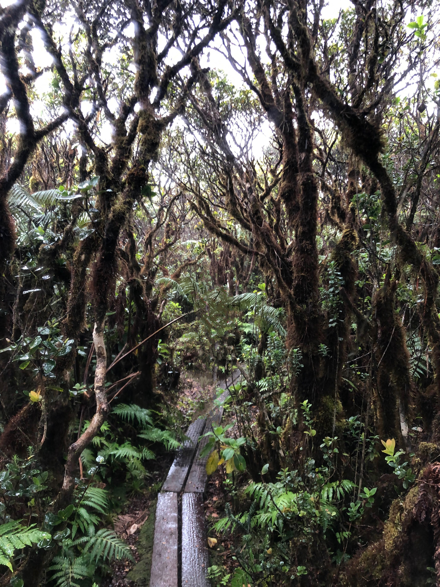
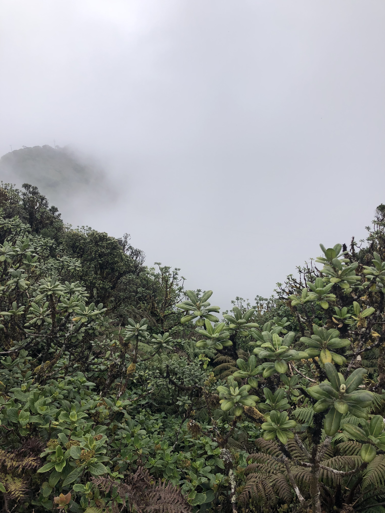

  
  

Wetlands cover little area in contrast to crucial carbon storage role. Much research has been focused on high latitude peat bogs that are threatened by climate change, but tropical bogs are understudied. This study will aim to look at tropical, freshwater bogs that are threatened by increasingly hot and dry climates. 
