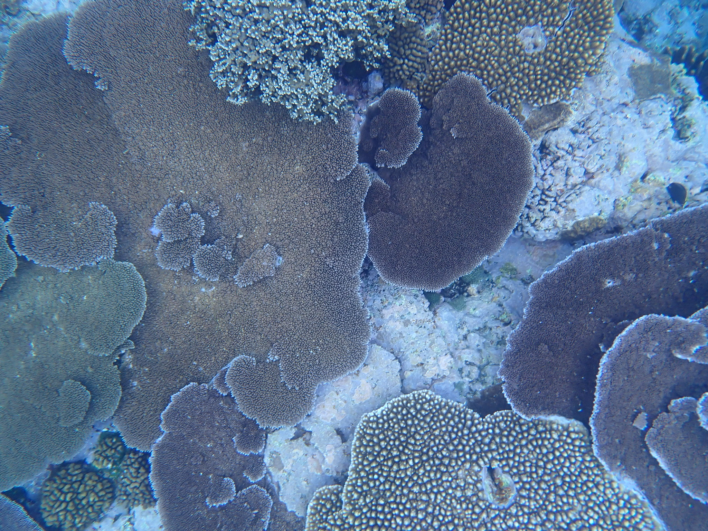
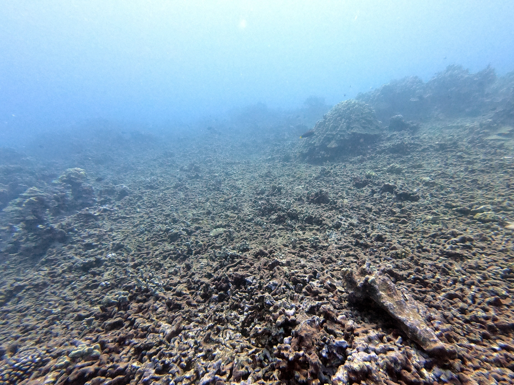
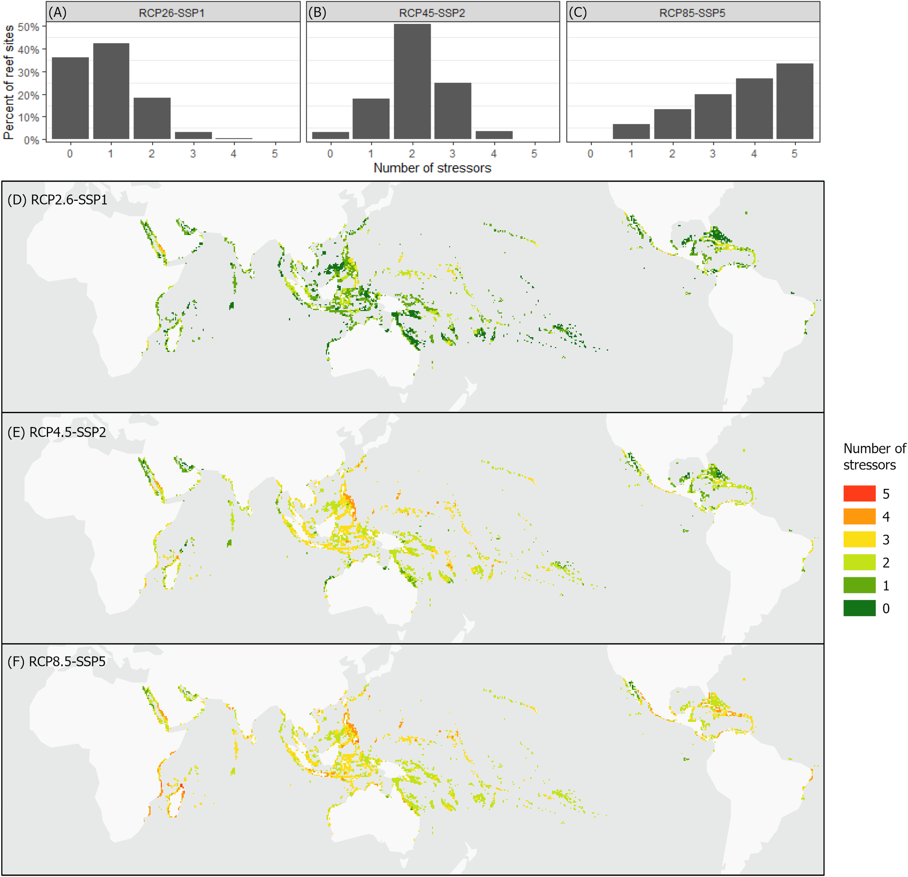

  
  
  

Anthropogenic disturbances are posing unprecedented challenges to the persistence of ecosystems worldwide with environmental levels quickly exceeding ecosystem tolerance thresholds. Using the world’s coral reefs as a case example, we show that the projected effects of marine heatwaves, ocean acidification, storms, land-based pollution, and local human stressors are being underestimated considerably by looking at disturbances independently. Under business-as-usual scenarios, the median year after which environmental conditions become unsuitable for the world’s remaining coral reefs was 2035, with unsuitable conditions for 99% of reefs by 2050. Furthermore, 93% of reefs would be under unsuitable conditions for multiple stressors by 2100. The full publication can be found [here](https://journals.plos.org/plosbiology/article?id=10.1371/journal.pbio.3001821). All relevant code can be found [here](https://github.com/rsetter/coral_expdate).
