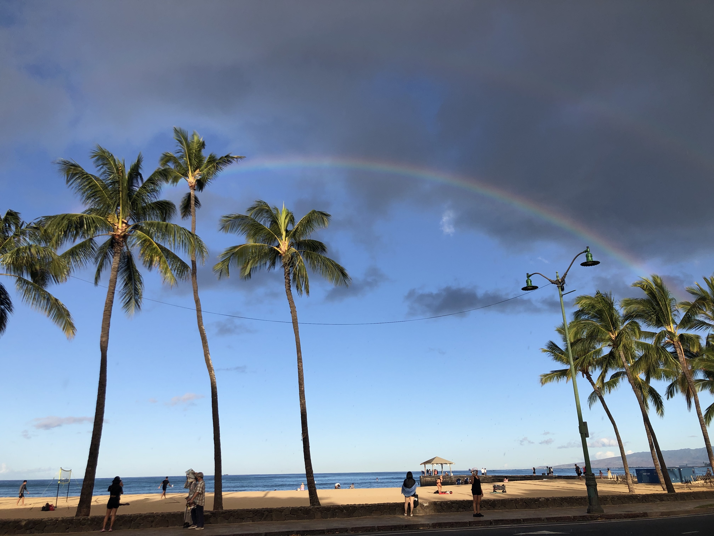
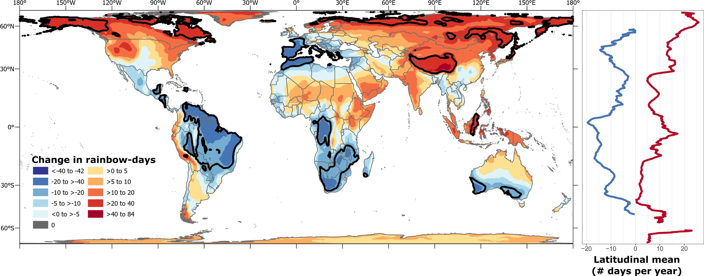

  
  

Changes in precipitation and cloud cover due to anthropogenic climate forcing are projected to alter rainbow distribution. We developed a global database of crowd-sourced photographed rainbows and applied this model to present-day climate and three future climate scenarios. By 2100, climate change is likely to generate a 4.0–4.9 % net increase in mean global annual rainbow-days. Around 21–34 % of land areas will lose rainbow-days and 66–79 % will gain rainbow-days, with rainbow gain hotspots mainly in high-latitude and high-elevation regions with smaller human populations. The full publication can be found [here](https://www.sciencedirect.com/science/article/pii/S095937802200142X).
