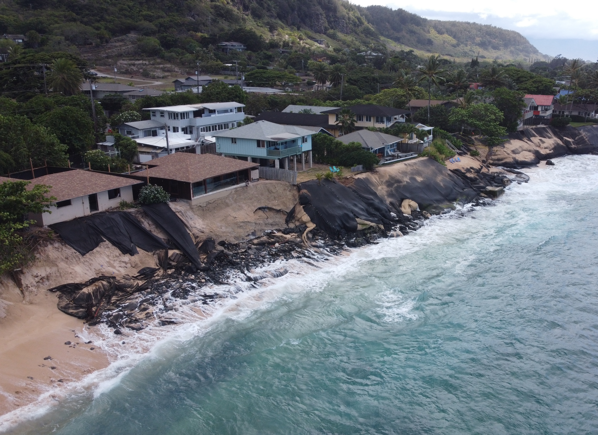
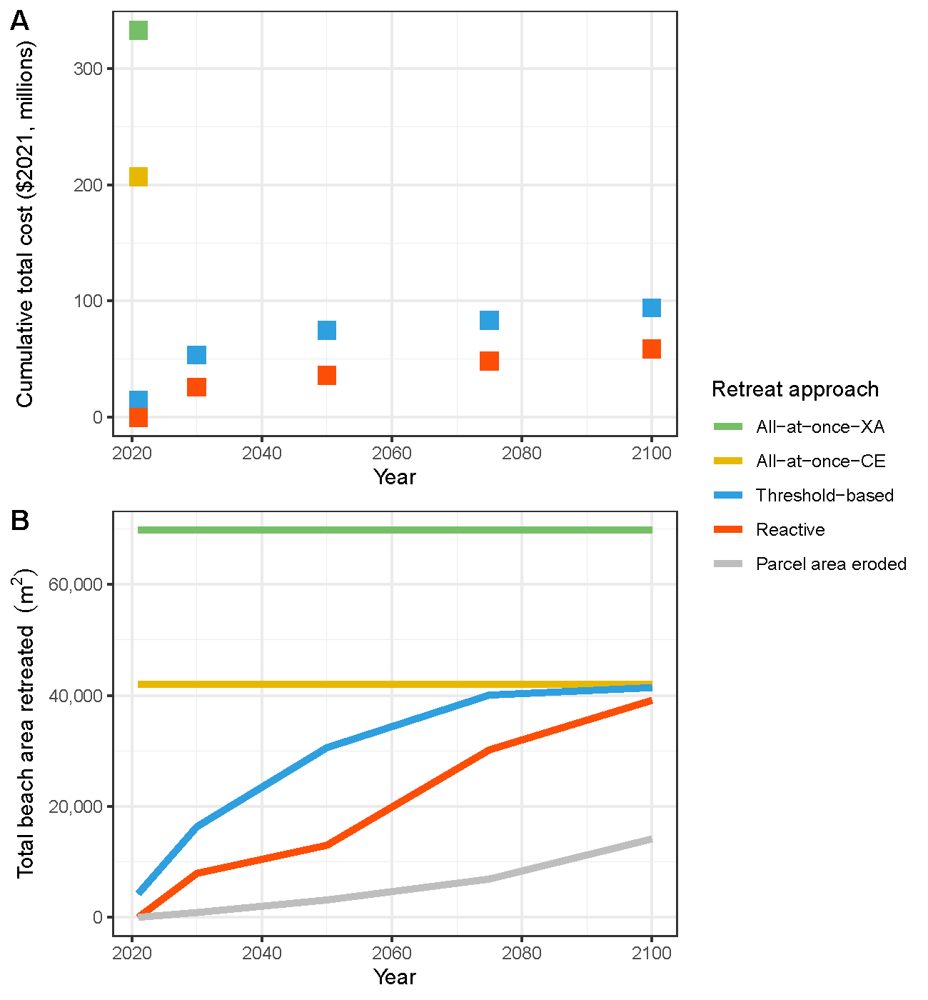

  
  

Sea level rise (SLR) is projected to impact almost all coastal communities in Hawaiʻi. For many coastal communities, retreat is the most viable long-term option due to exposure risk under SLR and increased coastal hazards. Our research analyzes the costs of retreating coastal development at an iconic beach in Hawaiʻi that is experiencing severe erosion. Utilizing detailed SLR modeling projected to the year 2100, we estimate the public and private costs of three unique retreat approaches and the amount of increased beach area. We find the threshold-based approach largely mitigates public safety and environmental risks while providing more beach area over time than the reactive approach with similar direct costs. This case study publication can be found [here](https://www.nature.com/articles/s41598-023-38939-4).

Current research with [the Institute for Sustainability and Resilience](https://manoa.hawaii.edu/isr/) is expanding this methodology in application to Oʻahu and Kauaʻi.

