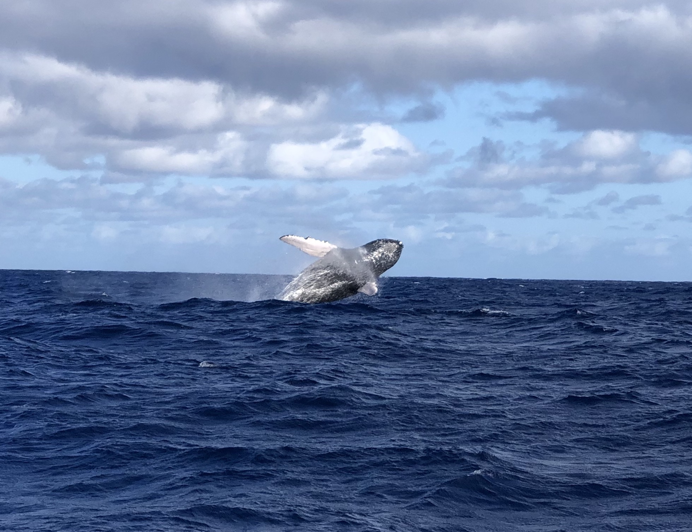
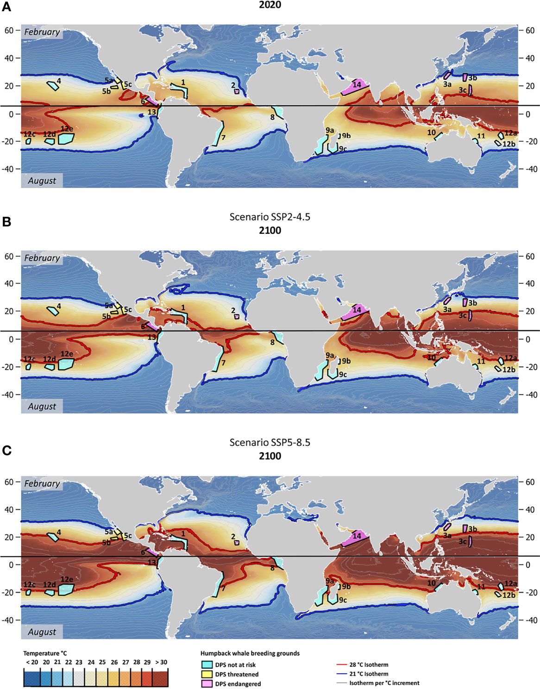

  
  

To study the impacts of a warming ocean on marine organisms, large-scale projections of climatic variables are crucial. Global models are of 0.25 - 1° (~25-100 km) resolution, and not ideal to predict localized changes. We calculated 0.05° resolution (~5 km) sea surface temperature (SST) projections, statistically downscaled using the delta method. We illustrate the shifting isotherms of the critical 21 and 28°C boundaries, which border the climatic envelope that humpback whales prefer for their breeding grounds. Results show by 2100, 35% of humpback whale breeding areas will experience SSTs above or within 1°C of current thresholds under middle-of-the-road scenario and 67% under business-as-usual.  The full publication can be found [here](https://www.frontiersin.org/articles/10.3389/fmars.2022.837772/full). All relevant code can be found [here](https://github.com/rsetter/whalescc).
